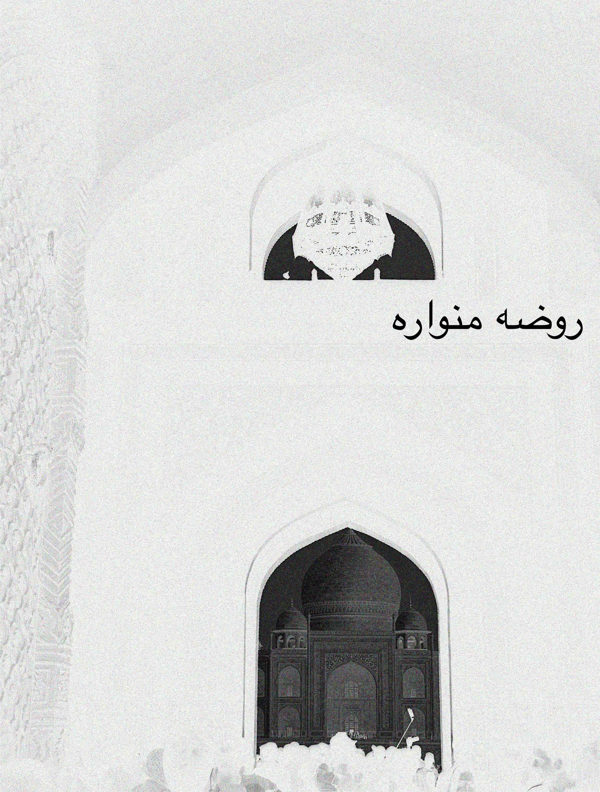
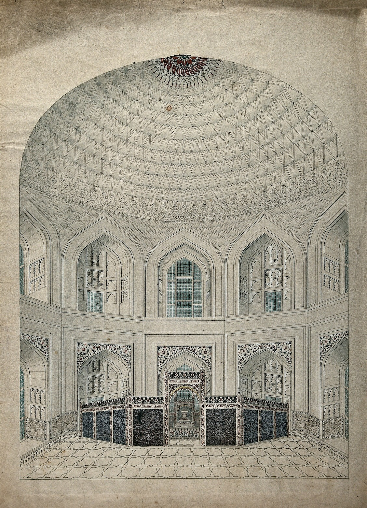

## &lrm;پادشاه‌نامه [^1]

\[Taj Mahal:\] روضه منواره [^2]
 anatomy of a history 
by 
Sri Purushottam Nagesh Oak 

ॐ असतो मा सद्गमय । 
तमसो मा ज्योतिर्गमय । 
मृत्योर्माऽमृतं गमय ॥ 
ॐ शान्तिः शान्तिः शान्तिः ॥ 

## Copyright

Copyright © 2023 Sri Purushottam Nagesh Oak

All rights reserved.

No part of this publication may be reproduced, stored in a retrieval
system, stored in a database and / or published in any form or by any
means, electronic, mechanical, photocopying, recording or otherwise,
without the prior written permission of the publisher.

Published in  કલા નગરી, *kalā nagarī*: "city of art"[^3] by મન, *man*: "mind"[^4]

Cataloging in Publication Data 
 
Name: Sri Purushottam Nagesh Oak, 2023— author 
Title: The Illumined Tomb/ Sri Purushottam Nagesh Oak 
ASIN: 
Subjects: 1. Signs & Symbols 2. Architecture 

## Content

List of Illustrations 
Acknowldgements 
Introduction 
Chronology of the Taj Mahal 
 
Part I: Farmans 
 
Royal Farman to Raja Jai Sing 
 
Part II. Inscriptions 
 
\[Taj Ganj\] 
\[Jilaukhana\] 
Darwaza-e-Rauza 
\[Charbagh\] 
Mausoleum 
Doorway 
Octagon 
\[Mehtab Bagh\] 
 
Part III: Narrations 
 
Padshah Nama of Qazwini 
Padshah Nama of Lahori 
Padshah Nama of Kalim 
Zafar Nama-i-Shaha Jahan of Qudsi 

## List of Illustrations

Frontcover: Gateway of Taj Mahal[^5] 
Introduction: Inside the Taj Mahal[^6] 
 
Gateway, South Arch 
Gateway, North Arch 
Tomb, South Arch 
Tomb, West Arch 
Tomb, North Arch 
Tomb, East Arch 
Doorway, South Door 
Doorway, West Door 
Doorway, North Door 
Doorway, East Door 
Octagon, North 
Octagon, Northeast 
Octagon, East 
Octagon, Southeast 
Octagon, South 
Octagon, Southwest 
Octagon, West 
Octagon, Northwest 

## Dedication 

DEDICATED TO THE MEMORY OF 
&lrm;تصویر نابینایی[^7]

## Acknowledgements

Begley, W. E., and Ziyaud-Din A. Desai, compilers and translators. Taj Mahal: The Illumined Tomb: An Anthology of Seventeenth-Century Mughal and European Documentary Sources. Aga Khan Program for Islamic Architecture; distributed by University of Washington Press, 1989.

## Introduction

> The cosmos is nothing in its existence except for the forms (al-ṣuwar)
> that were received by the Cloud and thus achieved manifestation in it.
> And the cosmos, when you gaze at its reality, is a vanishing accident
> (ʿaraḍ zāʾil) … The fixed substance (al-jawhar al-thābit) is the Cloud,
> which is nothing but the Breath of the all-Merciful, and the cosmos is
> everything that has become manifest in it of the forms. They are accidents
> that can possibly vanish. These forms are the possible things, and
> their relationship to the Cloud is the relation of forms that become manifest
> in a mirror to the eye of the one who sees. The Real, exalted is He, is
> the Sight of the Cosmos (baṣar al-ʿālam) and He is the one who sees. He
> is the Knower of the possible things, and he has not perceived anything
> but what was in His knowledge from the forms of the possible things.
> Thus, the cosmos was made manifest between the Cloud and the Vision
> of the Real (ruʾyat al-ḥaqq). What is made manifest indicates the one who
> sees, and that is the Real. So discern and know what you are  (Futūḥāt, 9.361).

## Chronology of The Illumined Tomb

0409 AH Mahmud of Ghazni Pillages Agra[^8] 
 
0910 AH Sikandar Khan Lodi Commissons Construction of Agra 
0923 AH Ibrahim Lodi Makes Agra The Capital 
 
0933 AH Babur Catpures Agra 
0947 AH Sher Shah Suri Captures Agra 
0963 AH Humayun Captures Agra 
0964 AH Hemu Captures Agra 
0965 AH Akbar Captures Agra 
 
0966 AH Akbar Makes Agra The Capital 
1039 AH Shah Jahan I Re-names Agra Akbarbad 
1041 AH Shah Jahan I Commissions Construction of Tomb for Mumtaz Mahal 
1042 AH Shah Jahan I Inters Mumtaz Mahal In The Illumined Tomb 
1043 AH Shah Jahan I Issues Farman To Acquire Raja Man Sing’s Manzil 
1046 AH Amanat Khan Shirazi Begins Inscription Work 
1062 AH Muhi al-Din Muhammad Carries Out Building Repairs 
1077 AH Aurangzeb Alamgir I Inters Shah Jahan I In The Illumined Tomb 
 
1175 AH Suraj Mal Captures Agra 
1188 AH Mirza Najaf Khan Catpures Agra 
1200 AH Mahadji Shinde Captures Agra 
1218 AH The East India Tea Company Captures Agra 
 
1222 AH Gilbert John Elliot-Murray-Kynynmound Carries Out Building Repairs 
1327 AH George Nathaniel Curzon Carries Out Building Repairs And Modifications 
 
1437 AH Archeological Survey of India Begins Intermittent Repairs 

## Part I: Farman 

### Farman To Raja Jai Singh

> The mansions (haveli), together with their dependencies, belonging to
> the august crown estate, in exchange for the mansion (havelt)
> belonging to Raja Jai Singh, which that Pillar of the State ('Umdat
> al-Mulk), for the sake of the Illumined Tomb, willingly and
> voluntarily donated as a gift (peshkash namudand), have hereby been
> granted by us to the said Raja and settled on him in full ownership
> (Begley and Desai 170).[^9]

## Part II: Inscriptions

### Darwaza-e-Rauza

> IN THE NAME OF GOD, THE MOST GRACIOUS, THE DISPENSER OF GRACE: 
> \(1\) CONSIDER the daybreak 
> \(2\) and the ten nights! 
> \(3\) Consider the multiple and the One! 
> \(4\) Consider the night as it runs its course! 
> \(5\) Considering all this – could there be, to anyone endowed with
> reason, a \[more\] solemn evidence of the truth? 
> \(6\) ART THOU NOT aware of how thy Sustainer has dealt with \[the
> tribe of\] \`Ād, 
> \(7\) \[the people of\] Iram the many-pillared, 
> \(8\) the like of whom has never been reared in all the land? – 
> \(9\) and with \[the tribe of\] Thamūd, who hollowed out rocks in the
> valley? – 
> \(10\) and with Pharaoh of the \[many\] tent-poles? 
> \(11\) \[It was they\] who transgressed all bounds of equity all over
> their lands, 
> \(12\) and brought about great corruption therein: 
> \(13\) and therefore thy Sustainer let loose upon them a scourge of
> suffering: 
> \(14\) for, verily, thy Sustainer is ever on the watch! 
> \(15\) BUT AS FOR man, whenever his Sustainer tries him by His
> generosity and by letting him enjoy a life of ease, he says, “My
> Sustainer has been \[justly\] generous towards me”; 
> \(16\) whereas, whenever He tries him by straitening his means of
> livelihood, he says, “My Sustainer has disgraced me!” 
> \(17\) But nay, nay, \[O men, consider all that you do and fail to
> do:\] you are not generous towards the orphan, 
> \(18\) and you do not urge one another to feed the needy, 
> \(19\) and you devour the inheritance \[of others\] with devouring
> greed, 
> \(20\) and you love wealth with boundless love! 
> \(21\) Nay, but \[how will you fare on Judgment Day,\] when the earth
> is crushed with crushing upon crushing, 
> \(22\) and \[the majesty of\] thy Sustainer stands revealed, as well
> as \[the true nature of\] the angels, rank upon rank? 
> \(23\) And on that Day hell will be brought \[within sight\]; on that
> Day man will remember \[all that he did and failed to do\]: but what
> will that remembrance avail him? 
> \(24\) He will say, “Oh, would that I had provided beforehand for my
> life \[to come\]!” 
> \(25\) For none can make suffer as He will make suffer \[the sinners\]
> on that Day, 
> \(26\) and none can bind with bonds like His. 
> \(27\) \[But unto the righteous God will say,\] “O thou human being
> that hast attained to inner peace! 
> \(28\) Return thou unto thy Sustainer, well-pleased \[and\] pleasing
> \[Him\]: 
> \(29\) enter, then, together with My \[other true\] servants – 
> \(30\) yea, enter thou My paradise!”(*Message of the Qurʼan* 782)

## Part III: Narrations  

### Padshah Nama of Qazwini

> \[fol. 43a\] THE BEGINNING OF THE WORLD-ILLUMINATION OF THE KING OF
> LOFTY FORTUNE, THE BETROTHAL OF THE LADY, HER MAJESTY THE QUEEN
> (NAWWAB MAHD-ULYA), MUMTAZ AL-ZAMANI TO HIS MAJESTY, AND HIS
> APPOINMENT TO THE POST OF MASTER OF CORRESPONDENCE
> (SAHIB-I-RISALAGI-I-KUL), AND OTHER EVENTS (Begley and Desai
> 1).[^10]

### Padshah Nama of Lahori

> On the night of the 17th of Zil-Qada 1052 \[6 February 1643\], the
> assembly of the death anniversary (urs) of Her late Majesty the Queen,
> Mumtaz al-Zamani, was held at the Illumined Tomb (rauza-i-munavvara)
> of that one enveloped in divine forgiveness and favor-which had been
> completed about this time, and whose detailed description will
> presently be given. And those men of piety who were in attendance,
> comprising learned scholars, saintly persons, those who had committed
> the Quran to memory (huffaz), and the needy and deserving, devoted
> themselves to reciting the Our'an and the Fatiha. And having graced
> that bountiful place with his presence, the Monarch of ocean-like
> liberality distributed at this function half of the fixed sum of
> 50,000 rupees, and the next morning, he returned again, and
> distributed the remaining half among the assembled women (Begley and Desai
> 65).[^11]

### Padshah Nama of Kalim

> \(1\) Upon her grave—may it be illumined till the Resurrection!—The
> King of Kings constructed such an edifice, 
> \(2\) That since the Divine Decree drew creation’s plan, Non one has
> seen its equal in magnificence. 
> (3)An edifice, whose quality imparts such stability And firmness to
> the mansion of description, 
> (4)That, even if they became submerged in water, Its couplets (bait)
> \[also meaans house\] would escape ruin. 
> (5)Since heaven’s vault has been standing, an edifce like this Has
> never risen to compete against the sky (Begley and Desai 82).[^12]

### Zafar Nama-i-Shah Jahan of Qudsi

> \(1\) How excellent is the holy tomb of the Bilqis of the Age, Which
> became the couch of that Lady of the Universe. 
> \(2\) An illumined place like the garden of Paradise; As fragrant as
> Paradise mixed with ambergris. 
> \(3\) The Houris, adored with scented beauty marks \[?\], Continually
> sweep its courtyard with the brooms of their eyelashes. 
> \(4\) Its walls are studded with precious gems, Lending the air
> exhirlatering freshness from their watery luster. 
> \(5\) The builder of this sacred threshold, Has brought its water
> \[luster\] from the fountainhead of divine beauty (Begley and Desai 85).[^13]

## Bibliography

painting, with watercolour, Wellcome Collection, c. 1800, pp. Agra: the
Taj Mahal, interior view of the vaulted dome over the tombs of Shah
Jahan and Mumtaz. Gouache painting by an Indian painter.

*The Message of the Qurʼan.* Translated by Muhammad Asad, Book
Foundation, 2004.

Balasubramaniam, R. "New insights on the modular planning of the Taj Mahal." Current Science (2009): 42-49.

Begley, Wayne E. "The Myth of the Taj Mahal and a New Theory of Its
Symbolic Meaning." *The Art Bulletin*, vol. 61, no. 1, 1979, pp. 7-37.

Begley, Wayne Edison and Ziyaud-Din A. Desai. *Taj Mahal: The Illumined
Tomb : An Anthology of Seventeenth-Century Mughal and European
Documentary Sources.* Aga Khan Program for Islamic Architecture, 1989.

Belsare, Malhar Bhikaji. *ગુજરાતી-અંગ્રેજી ડિકશનરી \[Etymological
Gujarati-English Dictionary\].* 2nd Edition, Asian Educational Services,
2002.

Karjoo-Ravary, Ali. "Mapping the Unseen: Ibn al-ʿArabī’s Maps in Chapter 371 of al-Futūḥāt al-Makkiyya". Journal of Sufi Studies 12.1 (2023): 1-64.

Moin, A. Azfar. *The Millennial Sovereign: Sacred Kingship and Sainthood in Islam.* United Kingdom, Columbia University Press, 2012.

Sehrawat, Sourabh. <a href="https://unsplash.com/photos/a-group-of-people-standing-in-front-of-a-white-building-fR7Gj0qSk64">"a group of people standing in front of a white building \[Taj Mahal\]"<a>. Unsplash, 2022, unsplash.com/photos/a-group-of-people-standing-in-front-of-a-white-building-fR7Gj0qSk64. 1 January 2023.

Sharma, Sunil. *Persian Poetry at the Indian Frontier: Masʻŝud Saʻd
Salmân of Lahore.* Permanent Black, 2000.

[^1]: &lrm;پادشاه‌نامه, padshah nama: “Chronicle of the Emperor (Begley and Desai xxiii)"

[^2]: &lrm;روضه منواره, rauza-i-munawwara: “The Illumined Tomb [In A Garden] (Begley and Desai 49)”

[^3]: કલા, Classical form of કળા An art (Belsare 227) + નગર a city (Belsare 301).

[^4]: તન-મન-ધન a. n. \[See તન + મન + ધન\] Lit. The body, the mind, and
    one’s wealth. Hence, 2. All that one loves; the highest object of
    one’s ambition (Belsare 577).

[^5]: Sehrawat, Sourabh. 2022, p. a group of people standing in front of
    a white building \[Taj Mahal\].

[^6]: painting, with watercolour, Wellcome Collection, c. 1800, pp.
    Agra: the Taj Mahal, interior view of the vaulted dome over the
    tombs of Shah Jahan and Mumtaz. Gouache painting by an Indian
    painter.

[^7]: &lrm;تصویر نابینایی, surat al-‘ama: “Image of the Obscurity” (Begley 34).

[^8]: “[I]t is not clear who actually conquered Agra or when (Sharma 44-45).”

[^9]: Jaipur City Palace, Kapad Dwara Collection, K.D. No. 176/R.

[^10]: Qazwini, Muhammad Amina. *Padshah Nama*. Br. Lib., MSS. Or. 174,
    Or. 1671.

[^11]: Lahori, ‘Abd Al-Hamid. *Padsha Nama*, ed by Maulvi Kabiruddin and
    Maulvi Abdur Rahim, 2 vols. Cacutta, Bibiltheca Indica, 1867-72.

[^12]: Kalim, Abu Talib, *Padshah Nama*, Br. Lib., MS. Or 357.

[^13]: Qudsi, Muhammad Jan*. Zafar Nama-i-Shah Jahan*, various MSS.
